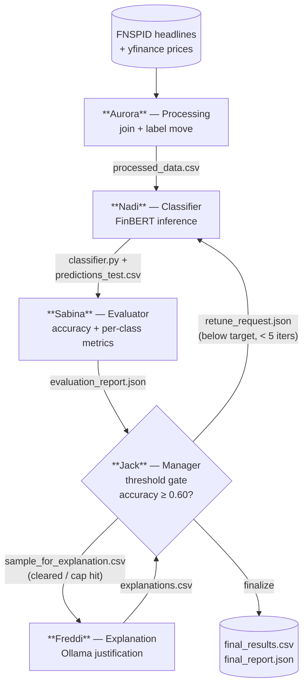

# NLP_lab

Predict next-day stock move (**up / down / neutral**) from financial-news
headlines with FinBERT, then explain each prediction in plain text. Five agents
pass contract files to each other in a retune loop driven by the Manager.

See [`CLAUDE.md`](./CLAUDE.md), [`docs/architecture.md`](./docs/architecture.md),
and [`docs/data_contracts.md`](./docs/data_contracts.md) for the full design.

## Pipeline flow



**Loop:** the Manager gates on accuracy. Below the 0.60 target it writes a
`retune_request.json` and sends Nadi back around; once the target clears (or the
5-iteration cap forces it), it samples rows for Freddi, then joins the
explanations into the final outputs.

## Setup & run

Python 3.13, uv-managed. From repo root:

```bash
uv sync
uv run main.py          # drives the full pipeline
```
