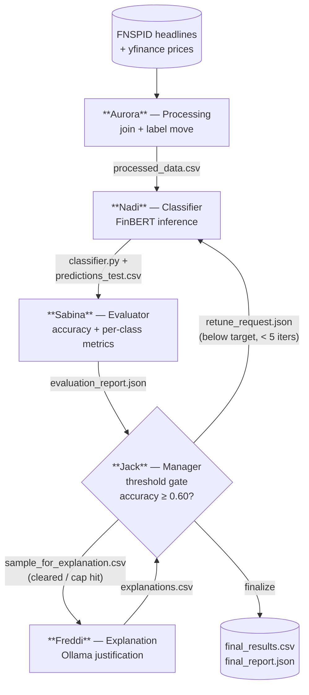

# NLP Lab - Predicting Stock Movement from Financial News Headlines

A five-agent NLP pipeline that predicts the **next-day stock move** (`up` / `down` /
`neutral`) from a financial-news headline using **FinBERT**, evaluates itself in a
feedback loop, and explains every prediction in plain English.

> **Are you Prof. Hristova? Start with [Quick start](#quick-start), then [Repository map](#repository-map) :) .**
> To see results *without running anything*, open [`outputs/final_report.json`](./outputs/final_report.json).

---

## Introduction

**Motivation.** Financial news is assumed to move markets, and modern language models
can read that news. If a model can extract sentiment from a headline, can it also
predict what the price does next?

**Main question.** *Can a single financial-news headline predict the next day's stock
movement (up / down / neutral)?*

**Contribution.** Two things:

1. **A working multi-agent system.** Five specialised agents, connected as one
   **LangGraph**, exchanging defined contract files. The Manager evaluates
   results and sends the classifier back to retry with new settings (feedback cycle).
2. **An honest answer to the question.** Our best full-pipeline run reaches **0.50**
   accuracy against a **0.516** majority-class baseline. The model is nearly blind to
   `down` moves (5% recall).

---

## Quick start

Python 3.13. **Recommended:** [uv](https://docs.astral.sh/uv/), which installs the
exact locked dependency versions from `uv.lock`.

```bash
uv sync                                                  # install dependencies
uv run main.py --no-ollama --dataset-end 2019-12-31      # run the full pipeline
```

**Why `--dataset-end 2019-12-31`?** It drops rows after that date, keeping the COVID
crash out of the data. Our dataset runs to mid-2020, and because the split is by date
the 2020 crash would otherwise land entirely in the *test* set.
**All reported results below use this flag**, so it's important to include it to reproduce them
(11,067 rows → 7,991 train / 880 val / 2,196 test).

<details>
<summary>Alternative: plain pip</summary>

If you would rather not install uv, `requirements.txt` mirrors the same
dependencies (it is not used by `uv sync`):

```bash
python -m venv .venv && source .venv/bin/activate
pip install -r requirements.txt
python main.py --no-ollama --dataset-end 2019-12-31
```

</details>

`--no-ollama` skips the local LLM used for explanations, so the pipeline runs with no
extra setup. To generate real LLM explanations instead, install
[Ollama](https://ollama.com), pull `llama3.2`, and drop the flag.

### What ships, and what is fetched

**Data (included).** Both inputs ship with the repo: the raw headlines
(`data/fnspid_raw.csv`) and the cached price history (`data/price_cache.pkl`). No
yfinance download is needed, and the cache keeps results reproducible since yfinance
can return revised history over time. Delete the cache to re-fetch prices live.

**Results (included).** [`outputs/`](./outputs) holds the artifacts of a completed
end-to-end run, so the results can be inspected and graded without running anything.

**Model weights (not included, fetched or regenerated):**

| | Size | How to get it |
|---|---|---|
| Pretrained FinBERT (`ProsusAI/finbert`) | ~440 MB | Downloads automatically from Hugging Face on first use, then cached locally. **The first run needs internet for this.** |
| Our fine-tuned weights | ~420 MB | Not shipped, to keep the submission small. Regenerate by running the Processing agent first, then the fine-tuner (both seeded and reproducible) - see below. Results are logged in [`docs/finetune_runs.md`](./docs/finetune_runs.md). |

Neither is required to inspect the committed results but only to re-run the pipeline
yourself. To reproduce the fine-tuned weights:

```bash
uv run agents/aurora_processing.py --dataset-end 2019-12-31   # writes data/processed_data.csv
uv run agents/finetune_finbert.py                             # writes outputs/finbert_finetuned/
uv run main.py --no-ollama --model-dir outputs/finbert_finetuned --dataset-end 2019-12-31
```

### Useful flags

| Flag | Default | What it does |
|---|---|---|
| `--no-ollama` | off | Skip the LLM; use deterministic placeholder explanations |
| `--dataset-end YYYY-MM-DD` | none | Drop rows after this date before splitting (e.g. `2019-12-31` excludes the COVID crash) |
| `--target-accuracy` | `0.60` | The Manager's accuracy gate |
| `--max-iterations` | `5` | Cap on retune cycles |
| `--threshold` | `0.01` | Label band: ±1% next-day change = `up`/`down`, else `neutral` |
| `--model-dir` | none | Load fine-tuned FinBERT weights instead of pretrained |
| `--sample-size` | `300` | Rows sampled for explanation |
| `--data-dir` | `data/` | Where `fnspid_raw.csv` lives |

### Run the tests

```bash
uv run python -m pytest tests/ -q
```

### View the dashboard

The dashboard we presented in class is a [marimo](https://marimo.io) app, so it needs
`marimo run` — plain `python dashboard.py` will not open it:

```bash
uv run marimo run dashboard.py     # the presentation view
uv run marimo edit dashboard.py    # editable/interactive version
```

It reads the committed contract files in `outputs/` and shows the results as charts,
including the confidence-vs-accuracy trade-off discussed in [Future work](#future-work).

---

## Repository map

**Where to look first**, in order:

| # | Path | What it is |
|---|---|---|
| 1 | [`main.py`](./main.py) | Entry point. It parses flags, invokes the pipeline graph |
| 2 | [`agents/pipeline_graph.py`](./agents/pipeline_graph.py) | **The orchestration.** All five agents wired into one LangGraph with the retune cycle |
| 3 | [`agents/`](./agents) | One module per agent, each owned by one team member |
| 4 | [`outputs/`](./outputs) | **Committed results** from a real run. You can use to inspect without running anything |
| 5 | [`docs/`](./docs) | Design rationale, data contracts, and the EDA notebook (table below) |

### Full structure

```
main.py                    entry point (CLI flags → pipeline)
dashboard.py               marimo dashboard (we showed this in the presentation)

agents/
  pipeline_graph.py        the unified LangGraph: nodes, edges, retune cycle
  base.py                  shared Agent base class (build_graph + run)
  state.py                 PipelineState - the shared state passed between nodes
  contracts.py             one definition of every handoff file format
  env.py                   .env loading
  aurora_processing.py     1. Processing agent
  nadi_classifier.py       2. Classifier agent
  sabina_evaluator.py      3. Evaluator agent
  jack_manager.py          4. Manager agent (the gate + loop control)
  freddi_explanation.py    5. Explanation agent
  finetune_finbert.py      standalone fine-tuning script (run once, offline)

data/
  fnspid_raw.csv           raw news headlines (committed)
  price_cache.pkl          cached yfinance prices (generated on first run usually, status now: committed for submission)
  processed_data.csv       Aurora's output (generated)

outputs/                   committed results of a real end-to-end run
  final_report.json        headline metrics
  final_results.csv        every test prediction + explanation
  predictions_test.csv     raw classifier output
  evaluation_report.json   Sabina's metrics + proposal
  explanations.csv         Freddi's per-prediction justifications
  decision.json            the Manager's decision log

mock_data/                 small valid sample of every handoff file (used by tests)
tests/                     pytest suite
docs/                      design docs + the EDA notebook (see below)
```

### Documentation

| File | Contents |
|---|---|
| [`docs/architecture.md`](./docs/architecture.md) | System design, agent roles, evaluation axes |
| [`docs/data_contracts.md`](./docs/data_contracts.md) | Exact columns/types of every handoff file |
| [`docs/processing_experiments.ipynb`](./docs/processing_experiments.ipynb) | **EDA and threshold calibration** — how the ±1% label band and the 1st–99th percentile outlier fences were derived from the data (with plots) |
| [`docs/retune_loop.md`](./docs/retune_loop.md) | How the feedback loop adapts across iterations |
| [`docs/finetune_runs.md`](./docs/finetune_runs.md) | Fine-tuning experiments and the overfitting finding |
| [`docs/experiments/`](./docs/experiments) | Metric-optimisation experiment write-up |

---

## Pipeline flow


```mermaid
flowchart TD
    raw[("FNSPID headlines<br/>+ yfinance prices")] --> aurora

    aurora["**Aurora** — Processing<br/>join + label move"]
    nadi["**Nadi** — Classifier<br/>FinBERT inference"]
    sabina["**Sabina** — Evaluator<br/>accuracy + per-class metrics"]
    manager{"**Jack** — Manager<br/>threshold gate<br/>accuracy ≥ 0.60?"}
    freddi["**Freddi** — Explanation<br/>Ollama justification"]
    final[("final_results.csv<br/>final_report.json")]

    aurora -->|processed_data.csv| nadi
    nadi -->|classifier.py +<br/>predictions_test.csv| sabina
    sabina -->|evaluation_report.json| manager
    manager -->|"retune_request.json<br/>(below target, &lt; 5 iters)"| nadi
    manager -->|"sample_for_explanation.csv<br/>(cleared / cap hit)"| freddi
    freddi -->|explanations.csv| manager
    manager -->|finalize| final
```


### Design decisions

The choices that shape the results, and why each was made:

| Decision | Why |
|---|---|
| **±1% label band** — `up` above +1%, `down` below −1%, else `neutral` | Derived from the price-change distribution in the [EDA notebook](./docs/processing_experiments.ipynb); the same 0.01 cutoff used by Jiang & Zeng |
| **Split by date, never randomly** | A model predicting the future must train on the past and be tested on a future it has never seen — a random split would leak future information |
| **`val` = last 10% of the training dates** | The retune loop scores itself on `val`, so `test` stays untouched until the final report and the loop cannot overfit its own measurement |
| **Classifier predicts held-out rows only** | Training rows were already seen by the model; scoring them would inflate accuracy |
| **Explanations from the headline only** | Freddi never sees the true outcome, so it cannot rationalise backwards from the answer — it explains at prediction time, like a real system would |
| **The gate is pure rules; the LLM writes only prose** | Every control decision (retune vs proceed, which settings to try, the metrics) must be reproducible and auditable; a stochastic model cannot be allowed to flip them |
| **Outliers trimmed at the 1st–99th percentile** | Stock returns are fat-tailed, so the usual IQR×1.5 rule discarded ~10% of the data; percentile fences keep exactly 98% regardless of distribution shape |

---

## Results

From the committed run in [`outputs/final_report.json`](./outputs/final_report.json)
— 2,196 held-out test headlines, scored once, after 5 loop iterations, with the
COVID period excluded (`--dataset-end 2019-12-31`):

| Metric | Value |
|---|---|
| **Test accuracy** | **0.50** |
| Majority-class baseline (always `neutral`) | **0.516** |
| Recall — `up` | 0.36 *(n = 578)* |
| Recall — `down` | **0.05** *(n = 485)* |
| Recall — `neutral` | 0.76 *(n = 1,133)* |
| Balanced accuracy | 0.39 *(chance = 0.333)* |
| Explanations generated | 300 |

**How to read this.** On plain accuracy the model (0.50) does *not* beat
always-guessing-neutral (0.516) — because neutral is 52% of the test set, so that one
class carries the score. On **balanced accuracy**, which weights all three classes
equally and therefore cannot be gamed by the majority class, the model scores **0.39
against a 0.333 chance baseline** — modest improvement, earned by the up
(0.36) and down (0.05) predictions that always-neutral scores 0.00 on.

The consistent finding across every architecture and hyperparameter setting we tried:
**`down` moves are near-unpredictable from a single headline.** Fine-tuning peaked
after one epoch in every run (immediate overfitting), and no combination of settings
moved balanced accuracy meaningfully above chance. This matches published work —
Karaoglu & Gowda (2026) found that across five sentiment models and six prediction
horizons, *none* beat the majority-class baseline. Full analysis:
[`docs/finetune_runs.md`](./docs/finetune_runs.md) and
[`docs/experiments/`](./docs/experiments).

### References

- **Devlin et al. (2019)**, *BERT: Pre-training of Deep Bidirectional Transformers*
  ([arXiv:1810.04805](https://arxiv.org/abs/1810.04805)) — our fine-tuning
  hyperparameters (batch 16, lr 2e-5, 3 epochs) sit inside the ranges recommended in
  Appendix A.3.
- **Jiang & Zeng (2025)**, *Financial Sentiment Analysis Using FinBERT with Application
  in Predicting Stock Movement* — source for the **±1% label threshold**; their
  Numerical Sentiment Index uses the identical 0.01 return cutoff.
- **Karaoglu & Gowda (2026)**, *Can News Predict the Market? Limits of Zero-Shot
  Financial NLP* — independent corroboration that **no model beat the majority-class
  baseline** for short-horizon prediction, with near-zero recall on negative moves.

---

## Future work

1. **Set a realistic target.** The `0.60` gate was chosen before anything was measured;
   the majority-class baseline is `0.516`, so that is the real bar. Report balanced
   accuracy (baseline `0.333`) as the headline metric, since plain accuracy is inflated
   by class imbalance.
2. **Aggregate headlines per ticker-day.** One headline carries very little signal;
   combining all news for a ticker on a given day could be the most promising next step.
3. **Deduplicate syndicated headlines.** The same story is republished across outlets;
   near-duplicates likely accelerate overfitting.
4. **Add a learning-rate schedule.** Fine-tuning currently uses a flat rate with no
   warmup or decay, which is a known accelerant for overfitting.
5. **Add non-text features.** Price momentum, volume, and volatility carry signal that
   headlines alone do not.
6. **Split the classifier into two directional heads.** From notes following our presentation discussion, 
  Instead of one model choosing between three classes, train **two independent binary models** — an `up`-head
   (`up` vs `neutral`) and a `down`-head (`down` vs `neutral`). Then we recombine their
   outputs into a three-way distribution, where `neutral` is the probability mass left
   over when neither head fires:

   ```
   raw = { up: p_up,  down: p_down,  neutral: (1 - p_up) * (1 - p_down) }
   ```
   normalised so the three sum to 1.

   The motivation is our weakest result: `down` recall of 0.05. In a single 3-class
   model, `down` competes against both other classes at once and loses. Giving it a
   dedicated binary model, trained **only** on `down` and `neutral` rows, never seeing
   `up` at all removes that competition and should sharpen the decision boundary the
   model actually struggles with.

   With the extra days for submission, the Manager's owner tried to prototype it in an open pull request in our project repo.
   **not yet validated on our data as it would take a long time**, so no accuracy claim is made here -> just a future improvement idea.
7. **Fine-tune inside the retune loop.** Today training happens once, offline, and each
   retune only adjusts inference settings (`threshold`, `boost_factor`) on fixed
   weights — so the loop can reshuffle predictions but never actually *learns* from the
   evaluator's feedback. Making every retune a fine-tuning pass on the weakest class
   would close that gap and turn the loop into genuine iterative training. This was also included in the prototype about two directional heads, but because it involves a much bigger PR changing a lot of the context of the project, we also decided not to include it in submission.
8. **Reject low confidence — we trade coverage for precision.** As we mentioned in the presentation during the dashboard, 
  the model's confidence turns out to be *informative*: filtering to only its more confident predictions
   raises accuracy sharply. Measured on the committed test set:

   | Min. confidence | Predictions kept | Coverage | Accuracy |
   |---|---|---|---|
   | none (all rows) | 2,196 | 100% | 0.497 |
   | ≥ 0.45 | 171 | 7.8% | **0.544** |
   | ≥ 0.50 | 42 | 1.9% | **0.738** |
   | ≥ 0.60 | 24 | 1.1% | **0.833** |

   At a 0.45 cutoff the model finally beats the 0.516 baseline, and above that it looks
   genuinely strong. The catch is of course coverage: it answers on under 8% of headlines, and by
   0.50 the samples are too small (42 rows) to trust the number. The model also stops
   predicting `up` entirely. Still, this reframes the task usefully in the context of suggesting financial decisions: instead of forcing
   a call on every headline, a practical system could **abstain by default and only act
   when confident**. Validating that properly needs a confidence cutoff tuned on the
   `val` split and reported with confidence intervals, not read off the test set.
   Explore it interactively in [`dashboard.py`](./dashboard.py).

---

## Team

| Agent | Owner | Module |
|---|---|---|
| Processing | Aurora | `agents/aurora_processing.py` |
| Classifier | Nadi | `agents/nadi_classifier.py` |
| Evaluator | Sabina | `agents/sabina_evaluator.py` |
| Manager | Jack | `agents/jack_manager.py` |
| Explanation | Freddi | `agents/freddi_explanation.py` |

Working agreement and contribution rules: [`CLAUDE.md`](./CLAUDE.md) ·
[`docs/collaborating.md`](./docs/collaborating.md)
