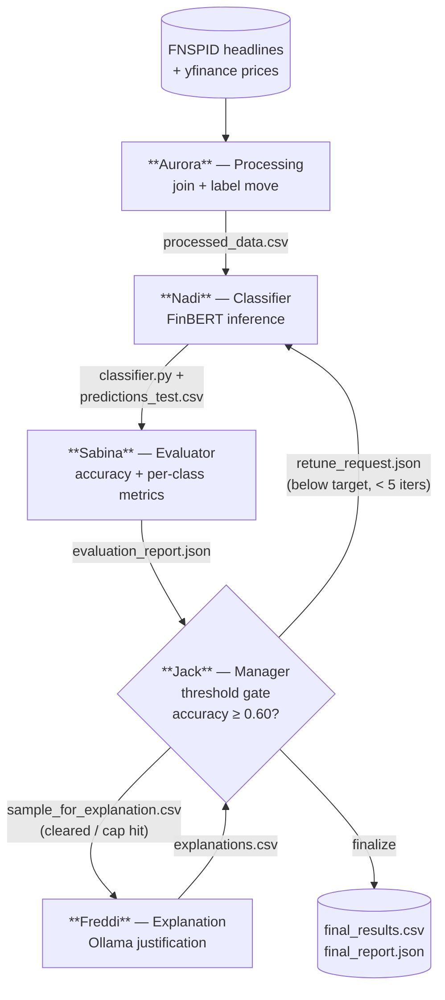

# NLP_lab

Predict next-day stock move (**up / down / neutral**) from financial-news
headlines with FinBERT, then explain each prediction in plain text. Five agents
pass contract files to each other in a retune loop driven by the Manager.

See [`CLAUDE.md`](./CLAUDE.md), [`docs/architecture.md`](./docs/architecture.md),
and [`docs/data_contracts.md`](./docs/data_contracts.md) for the full design.

## Pipeline flow


```mermaid
flowchart TD
    raw[("FNSPID headlines<br/>+ yfinance prices")] --> aurora

    aurora["**Aurora** — Processing<br/>join + label move"]
    nadi["**Nadi** — Classifier<br/>FinBERT inference"]
    sabina["**Sabina** — Evaluator<br/>accuracy + per-class metrics"]
    manager{"**Jack** — Manager<br/>threshold gate<br/>accuracy ≥ 0.60?"}
    freddi["**Freddi** — Explanation<br/>Ollama justification"]
    final[("final_results.csv<br/>final_report.json")]

    aurora -->|processed_data.csv| nadi
    nadi -->|classifier.py +<br/>predictions_test.csv| sabina
    sabina -->|evaluation_report.json| manager
    manager -->|"retune_request.json<br/>(below target, &lt; 5 iters)"| nadi
    manager -->|"sample_for_explanation.csv<br/>(cleared / cap hit)"| freddi
    freddi -->|explanations.csv| manager
    manager -->|finalize| final
```

**Loop:** the Manager gates on accuracy. Below the 0.60 target it writes a
`retune_request.json` and sends Nadi back around; once the target clears, the
accuracy plateaus (convergence early-stop), or the 5-iteration cap forces it, it
samples rows for Freddi, then joins the explanations into the final outputs. Each
retune escalates the classifier's hyperparameters instead of repeating, so the
loop actually explores rather than spinning.

The whole thing is one compiled **LangGraph** (`agents/pipeline_graph.py`) whose
retune loop is a real graph *cycle* (`gate → classify → evaluate → gate`), not a
Python loop. `main.py` just loads secrets, parses flags, and invokes the graph.

The compiled graph, rendered by LangGraph itself:


## Setup & run

Python 3.13, uv-managed. From repo root:

```bash
uv sync
uv run main.py          # drives the full pipeline
```

Sabina's evaluator is deterministic by default. To let Ollama review a small
misclassified-row sample and write the human-readable evaluator `reason` and
`code_notes` fields during a demo, start Ollama locally and run:

```bash
EVALUATOR_USE_OLLAMA=true uv run main.py
```

Optional knobs: `OLLAMA_URL` (default `http://localhost:11434/api/generate`) and
`EVALUATOR_OLLAMA_MODEL` (default `llama3.1`).

## Sabina's Evaluator Agent

The Evaluator Agent runs after the Classifier Agent and before the Manager Agent.

It does not train a model and it does not create new predictions. Its role is to check the classifier output, calculate evaluation metrics, and write a structured report for the Manager Agent.

### Evaluator input

The Evaluator receives:

- `predictions_test.csv`
- `classifier.py`

The prediction file contains the true labels, predicted labels, confidence values, class probabilities, and data split information.

The classifier file is read as text. The Evaluator uses it only to add short notes about the classifier setup, for example the threshold used for prediction.

### Evaluator output

The Evaluator writes:

- `evaluation_report.json`

This report contains:

- overall accuracy
- class accuracy for `up`, `down`, and `neutral`
- class support for each label
- number of misclassified examples
- ids of misclassified articles
- a recommendation for the Manager Agent: `retune` or `proceed`
- short reason and code notes

The final decision is still made by the Manager Agent. The Evaluator only provides the quality-control report.

### Evaluator LangGraph structure

The Evaluator Agent has a simple internal LangGraph with three nodes:

1. `load_inputs`
   - Loads the prediction CSV and classifier code.

2. `evaluate`
   - Validates the prediction file.
   - Checks required columns, labels, probabilities, confidence, and split values.
   - Calculates the evaluation metrics.

3. `write_report`
   - Writes the final `evaluation_report.json`.

This makes the Evaluator deterministic and easy to test. If the optional LLM review is enabled, it can only improve the wording of the explanation fields. It cannot change the metrics or the recommendation logic.

## Optional Ollama support

By default, Sabina's Evaluator Agent is deterministic.

To allow Ollama to improve the human-readable `reason` and `code_notes` fields during a demo, start Ollama locally and run:

```bash
EVALUATOR_USE_OLLAMA=true uv run main.py
```

Optional environment variables:

| Variable | Default |
|---|---|
| `OLLAMA_URL` | `http://localhost:11434/api/generate` |
| `EVALUATOR_OLLAMA_MODEL` | `llama3.1` |

## Evaluation logic

The main evaluation metric is accuracy. The Evaluator also reports class accuracy and class support.

Class accuracy is important because overall accuracy alone can be misleading. If the dataset contains many `neutral` examples, a model can reach a relatively high overall accuracy by predicting `neutral` too often. Per-class metrics make it easier to see whether the classifier also works for `up` and `down`.

Class support is included so that a missing class in one split is not confused with model collapse.
