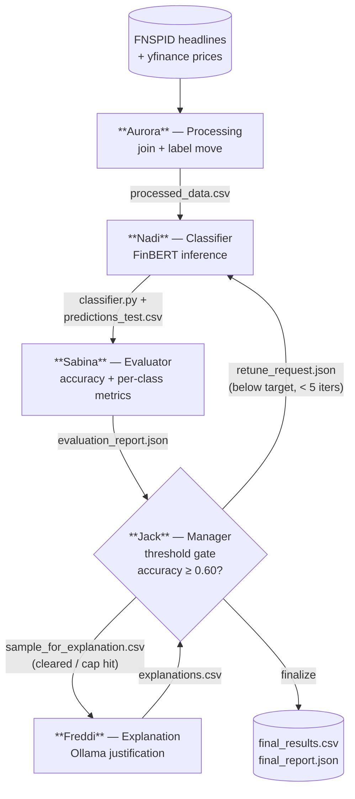
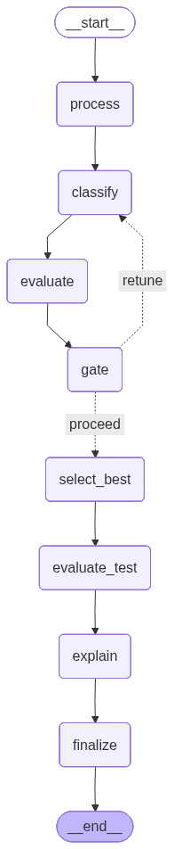

# NLP Lab - Predicting Stock Movement from Financial News Headlines

A five-agent NLP pipeline that predicts the **next-day stock move** (`up` / `down` /
`neutral`) from a financial-news headline using **FinBERT**, evaluates itself in a
feedback loop, and explains every prediction in plain English.

> **Are you Prof. Hristova? Start with [Quick start](#quick-start), then [Repository map](#repository-map) :) .**
> To see results *without running anything*, open [`outputs/final_report.json`](./outputs/final_report.json).

---

## Introduction

**Motivation.** Financial news is assumed to move markets, and modern language models
can read that news. If a model can extract sentiment from a headline, can it also
predict what the price does next?

**Main question.** *Can a single financial-news headline predict the next day's stock
movement (up / down / neutral)?*

**Contribution.** Two things:

1. **A working multi-agent system.** Five specialised agents, connected as one
   **LangGraph**, exchanging defined contract files. The Manager evaluates
   results and sends the classifier back to retry with new settings (feedback cycle).
2. **An honest answer to the question.** Our best full-pipeline run reaches **0.50**
   accuracy against a **0.516** majority-class baseline. The model is nearly blind to
   `down` moves (5% recall).

---

## Quick start

Python 3.13. **Recommended:** [uv](https://docs.astral.sh/uv/), which installs the
exact locked dependency versions from `uv.lock`.

```bash
uv sync                                                  # install dependencies
uv run main.py --no-ollama --dataset-end 2019-12-31      # run the full pipeline
```

**Why `--dataset-end 2019-12-31`?** It drops rows after that date, keeping the COVID
crash out of the data. Our dataset runs to mid-2020, and because the split is by date
the 2020 crash would otherwise land entirely in the *test* set — so we would be
measuring accuracy on a once-in-a-generation market shock rather than a normal regime.
**All reported results below use this flag**, so include it to reproduce them
(11,067 rows → 7,991 train / 880 val / 2,196 test). Omit it to run on the full
dataset instead (2,930 test rows).

<details>
<summary>Alternative: plain pip</summary>

If you would rather not install uv, `requirements.txt` mirrors the same
dependencies (it is not used by `uv sync`):

```bash
python -m venv .venv && source .venv/bin/activate
pip install -r requirements.txt
python main.py --no-ollama --dataset-end 2019-12-31
```

</details>

`--no-ollama` skips the local LLM used for explanations, so the pipeline runs with no
extra setup. To generate real LLM explanations instead, install
[Ollama](https://ollama.com), pull `llama3.2`, and drop the flag.

### What ships, and what is fetched

**Data (included).** Both inputs ship with the repo: the raw headlines
(`data/fnspid_raw.csv`) and the cached price history (`data/price_cache.pkl`). No
yfinance download is needed, and the cache keeps results reproducible since yfinance
can return revised history over time. Delete the cache to re-fetch prices live (we did this for you to save time to run)

**Results (included).** [`outputs/`](./outputs) holds the artifacts of a completed
end-to-end run, so the results can be inspected and graded without running anything.

**Model weights (not included, fetched or regenerated):**

| | Size | How to get it |
|---|---|---|
| Pretrained FinBERT (`ProsusAI/finbert`) | ~440 MB | Downloads automatically from Hugging Face on first use, then cached locally. **The first run needs internet for this.** |
| Our fine-tuned weights | ~420 MB | Not shipped, to keep the submission small. Regenerate by running the Processing agent first, then the fine-tuner (both seeded and reproducible) - see below. Results are logged in [`docs/finetune_runs.md`](./docs/finetune_runs.md). |

Neither is required to inspect the committed results but only to re-run the pipeline
yourself. To reproduce the fine-tuned weights:

```bash
uv run agents/aurora_processing.py --dataset-end 2019-12-31   # writes data/processed_data.csv
uv run agents/finetune_finbert.py                             # writes outputs/finbert_finetuned/
uv run main.py --no-ollama --model-dir outputs/finbert_finetuned --dataset-end 2019-12-31
```

### Useful flags

| Flag | Default | What it does |
|---|---|---|
| `--no-ollama` | off | Skip the LLM; use deterministic placeholder explanations |
| `--dataset-end YYYY-MM-DD` | none | Drop rows after this date before splitting (e.g. `2019-12-31` excludes the COVID crash) |
| `--target-accuracy` | `0.60` | The Manager's accuracy gate |
| `--max-iterations` | `5` | Cap on retune cycles |
| `--threshold` | `0.01` | Label band: ±1% next-day change = `up`/`down`, else `neutral` |
| `--model-dir` | none | Load fine-tuned FinBERT weights instead of pretrained |
| `--sample-size` | `300` | Rows sampled for explanation |
| `--data-dir` | `data/` | Where `fnspid_raw.csv` lives |

### Run the tests

```bash
uv run python -m pytest tests/ -q
```

### Inspect results without running anything

Every file in [`outputs/`](./outputs) is committed from a real end-to-end run.
Start with [`outputs/final_report.json`](./outputs/final_report.json) for the headline
metrics, or [`outputs/final_results.csv`](./outputs/final_results.csv) for every test
prediction alongside its generated explanation.

---

## Repository map

**Where to look first**, in order:

| # | Path | What it is |
|---|---|---|
| 1 | [`main.py`](./main.py) | Entry point — parses flags, invokes the pipeline graph |
| 2 | [`agents/pipeline_graph.py`](./agents/pipeline_graph.py) | **The orchestration.** All five agents wired into one LangGraph with the retune cycle |
| 3 | [`agents/`](./agents) | One module per agent (see [The five agents](#the-five-agents)) |
| 4 | [`outputs/`](./outputs) | **Committed results** from a real run — inspect without running anything |
| 5 | [`docs/architecture.md`](./docs/architecture.md) · [`docs/data_contracts.md`](./docs/data_contracts.md) | The design rationale and the exact format of every file agents exchange |

### Full structure

```
main.py                    entry point (CLI flags → pipeline)
dashboard.py               marimo dashboard

agents/
  pipeline_graph.py        the unified LangGraph: nodes, edges, retune cycle
  base.py                  shared Agent base class (build_graph + run)
  state.py                 PipelineState — the shared state passed between nodes
  contracts.py             one definition of every handoff file format
  env.py                   .env loading
  aurora_processing.py     1. Processing agent
  nadi_classifier.py       2. Classifier agent
  sabina_evaluator.py      3. Evaluator agent
  jack_manager.py          4. Manager agent (the gate + loop control)
  freddi_explanation.py    5. Explanation agent
  finetune_finbert.py      standalone fine-tuning script (run once, offline)

data/
  fnspid_raw.csv           raw news headlines (committed)
  price_cache.pkl          cached yfinance prices (generated on first run)
  processed_data.csv       Aurora's output (generated)

outputs/                   committed results of a real end-to-end run
  final_report.json        headline metrics
  final_results.csv        every test prediction + explanation
  predictions_test.csv     raw classifier output
  evaluation_report.json   Sabina's metrics + proposal
  explanations.csv         Freddi's per-prediction justifications
  decision.json            the Manager's decision log

mock_data/                 small valid sample of every handoff file (used by tests)
tests/                     pytest suite
docs/                      design docs and per-agent notebooks (see below)
```

### Documentation

| File | Contents |
|---|---|
| [`docs/architecture.md`](./docs/architecture.md) | **Start here.** System design, agent roles, evaluation axes |
| [`docs/data_contracts.md`](./docs/data_contracts.md) | Exact columns/types of every handoff file |
| [`docs/retune_loop.md`](./docs/retune_loop.md) | How the feedback loop adapts across iterations |
| [`docs/finetune_runs.md`](./docs/finetune_runs.md) | Fine-tuning experiments and the overfitting finding |
| [`docs/experiments/`](./docs/experiments) | Metric-optimisation experiment write-up |

**Per-agent code walkthroughs (notebooks):**
[Processing](./docs/aurora_processing_guide.ipynb) ·
[Processing EDA](./docs/processing_experiments.ipynb) ·
[Classifier](./docs/nadi_classifier_guide.ipynb) ·
[Evaluator](./docs/sabina_evaluator_guide.ipynb) ·
[Explanation](./docs/explanation_agent_walkthrough.ipynb)

---

## Pipeline flow


```mermaid
flowchart TD
    raw[("FNSPID headlines<br/>+ yfinance prices")] --> aurora

    aurora["**Aurora** — Processing<br/>join + label move"]
    nadi["**Nadi** — Classifier<br/>FinBERT inference"]
    sabina["**Sabina** — Evaluator<br/>accuracy + per-class metrics"]
    manager{"**Jack** — Manager<br/>threshold gate<br/>accuracy ≥ 0.60?"}
    freddi["**Freddi** — Explanation<br/>Ollama justification"]
    final[("final_results.csv<br/>final_report.json")]

    aurora -->|processed_data.csv| nadi
    nadi -->|classifier.py +<br/>predictions_test.csv| sabina
    sabina -->|evaluation_report.json| manager
    manager -->|"retune_request.json<br/>(below target, &lt; 5 iters)"| nadi
    manager -->|"sample_for_explanation.csv<br/>(cleared / cap hit)"| freddi
    freddi -->|explanations.csv| manager
    manager -->|finalize| final
```

**The loop.** The Manager gates on accuracy. Below target it writes a
`retune_request.json` and sends Nadi back around; once the target clears, accuracy
plateaus (convergence early-stop), or the 5-iteration cap forces it, it samples rows
for Freddi and joins the explanations into the final outputs. Each retune escalates
the classifier's settings rather than repeating, so the loop explores instead of
spinning.

The whole thing is **one compiled LangGraph** ([`agents/pipeline_graph.py`](./agents/pipeline_graph.py))
whose retune loop is a real graph *cycle* (`gate → classify → evaluate → gate`), not a
Python `while` loop. `main.py` only loads secrets, parses flags, and invokes the graph.



---

## The five agents

Every agent is a LangGraph behind a single `.run()` method
([`agents/base.py`](./agents/base.py)), so the pipeline can invoke any of them
identically and each stays independently testable.

### 1. Processing — Aurora
Joins FNSPID headlines to yfinance prices, computes the next-trading-day percentage
change, labels each row, and assigns a leak-free split.
- **Reads:** `data/fnspid_raw.csv`, yfinance
- **Writes:** `data/processed_data.csv`
- **Code:** [`agents/aurora_processing.py`](./agents/aurora_processing.py) · **Guide:** [notebook](./docs/aurora_processing_guide.ipynb)
- **Key choices:** ±1% label band; outliers trimmed at the 1st–99th percentile;
  **split by date, never randomly** (train on the past, test on the future);
  `val` = last 10% of training dates so the loop can tune without touching `test`.

### 2. Classifier — Nadi
A **code-generation** agent: it writes `classifier.py` as a standalone script, runs it,
and hands both the code *and* the predictions downstream.
- **Reads:** `processed_data.csv`, `retune_request.json`
- **Writes:** `classifier.py`, `predictions_test.csv`
- **Code:** [`agents/nadi_classifier.py`](./agents/nadi_classifier.py) · **Guide:** [notebook](./docs/nadi_classifier_guide.ipynb)
- **Key choices:** predicts held-out rows only (never training rows); pretrained or
  fine-tuned FinBERT (opt-in via `--model-dir`); each retune adjusts inference settings
  (`threshold`, `boost_factor`) on fixed weights — training happens once, offline.

### 3. Evaluator — Sabina
Scores the classifier's output and proposes the next action. It does **not** train
anything or produce predictions; it is the quality-control step.
- **Reads:** `predictions_test.csv`, `classifier.py` (as text)
- **Writes:** `evaluation_report.json`
- **Code:** [`agents/sabina_evaluator.py`](./agents/sabina_evaluator.py) · **Guide:** [notebook](./docs/sabina_evaluator_guide.ipynb)
- **Internal graph:** `load_inputs → evaluate → write_report`
- **Report contains:** overall accuracy, per-class accuracy, **class support**,
  misclassified count and ids, a `retune`/`proceed` recommendation, and short
  reason/code notes.
- **Key choices:** scores `val` during the loop and `test` exactly once at the end, so
  the loop cannot overfit the final measurement; reports **per-class support** so a
  label missing from a split is never mistaken for model collapse; flags class collapse
  explicitly. Metrics and the recommendation are deterministic — an optional LLM may
  only reword the human-readable fields, never change a number or a decision.

### 4. Manager — Jack
The orchestrator and the gate: it decides whether to retune or proceed, and assembles
the final deliverables.
- **Reads:** `evaluation_report.json`, `predictions_test.csv`, `explanations.csv`
- **Writes:** `decision.json`, `retune_request.json`, `sample_for_explanation.csv`,
  `final_results.csv`, `final_report.json`
- **Code:** [`agents/jack_manager.py`](./agents/jack_manager.py) · **Details:** [`docs/retune_loop.md`](./docs/retune_loop.md)
- **Key choices:** the gate is **pure rules** (an LLM only writes the rationale prose);
  a collapsed class cannot clear the gate, so an "always neutral" run can't fake a pass;
  if a retune makes things worse it reverts to the best settings and nudges gently; the
  pipeline finalises on the **best** iteration, not the last; it always terminates
  (convergence or iteration cap).

### 5. Explanation — Freddi
Generates a one-sentence plain-English justification for each sampled prediction.
- **Reads:** `sample_for_explanation.csv`
- **Writes:** `explanations.csv`
- **Code:** [`agents/freddi_explanation.py`](./agents/freddi_explanation.py) · **Guide:** [notebook](./docs/explanation_agent_walkthrough.ipynb)
- **Key choices:** explains from the **headline only** — it never sees the true outcome,
  so it cannot rationalise backwards; low temperature (0.3) for grounded, consistent
  wording; falls back to a deterministic placeholder if the LLM is unavailable, so the
  pipeline never crashes.

### Cross-cutting design
- **"LLM narrates, rules decide."** Every control decision — the gate, retune-vs-proceed,
  which settings to try, the metrics — is deterministic code. LLMs only write
  human-readable text. This keeps the system genuinely agentic without letting a
  stochastic model corrupt reproducible, auditable control flow.
- **Never crash.** Every LLM-dependent step has a safe fallback.
- **Contract-driven.** [`agents/contracts.py`](./agents/contracts.py) holds one shared
  definition of every handoff format, so agents can't drift apart, and
  [`mock_data/`](./mock_data) provides a valid sample of each file for testing.

---

## Results

From the committed run in [`outputs/final_report.json`](./outputs/final_report.json)
— 2,196 held-out test headlines, scored once, after 5 loop iterations, with the
COVID period excluded (`--dataset-end 2019-12-31`):

| Metric | Value |
|---|---|
| **Test accuracy** | **0.50** |
| Majority-class baseline (always `neutral`) | **0.516** |
| Recall — `up` | 0.36 *(n = 578)* |
| Recall — `down` | **0.05** *(n = 485)* |
| Recall — `neutral` | 0.76 *(n = 1,133)* |
| Balanced accuracy | 0.39 *(chance = 0.333)* |
| Explanations generated | 300 |

**How to read this honestly.** On plain accuracy the model (0.50) does *not* beat
always-guessing-neutral (0.516) — because neutral is 52% of the test set, so that one
class carries the score. On **balanced accuracy**, which weights all three classes
equally and therefore cannot be gamed by the majority class, the model scores **0.39
against a 0.333 chance baseline** — a real but modest improvement, earned by the up
(0.36) and down (0.05) predictions that always-neutral scores 0.00 on.

The consistent finding across every architecture and hyperparameter setting we tried:
**`down` moves are near-unpredictable from a single headline.** Fine-tuning peaked
after one epoch in every run (immediate overfitting), and no combination of settings
moved balanced accuracy meaningfully above chance. This matches published work —
Karaoglu & Gowda (2026) found that across five sentiment models and six prediction
horizons, *none* beat the majority-class baseline. Full analysis:
[`docs/finetune_runs.md`](./docs/finetune_runs.md) and
[`docs/experiments/`](./docs/experiments).

### References

- **Devlin et al. (2019)**, *BERT: Pre-training of Deep Bidirectional Transformers*
  ([arXiv:1810.04805](https://arxiv.org/abs/1810.04805)) — our fine-tuning
  hyperparameters (batch 16, lr 2e-5, 3 epochs) sit inside the ranges recommended in
  Appendix A.3.
- **Jiang & Zeng (2025)**, *Financial Sentiment Analysis Using FinBERT with Application
  in Predicting Stock Movement* — source for the **±1% label threshold**; their
  Numerical Sentiment Index uses the identical 0.01 return cutoff.
- **Karaoglu & Gowda (2026)**, *Can News Predict the Market? Limits of Zero-Shot
  Financial NLP* — independent corroboration that **no model beat the majority-class
  baseline** for short-horizon prediction, with near-zero recall on negative moves.

---

## Future work

1. **Set a realistic target.** The `0.60` gate was chosen before anything was measured;
   the majority-class baseline is `0.516`, so that is the real bar. Report balanced
   accuracy (baseline `0.333`) as the headline metric, since plain accuracy is inflated
   by class imbalance.
2. **Aggregate headlines per ticker-day.** One headline carries very little signal;
   combining all news for a ticker on a given day is the most promising next step.
3. **Deduplicate syndicated headlines.** The same story is republished across outlets;
   near-duplicates likely accelerate overfitting.
4. **Add a learning-rate schedule.** Fine-tuning currently uses a flat rate with no
   warmup or decay, which is a known accelerant for overfitting.
5. **Add non-text features.** Price momentum, volume, and volatility carry signal that
   headlines alone do not.
6. **Two-head architecture.** Separate binary `up`-vs-neutral and `down`-vs-neutral
   models may sharpen per-class discrimination — prototyped, not yet validated.

---

## Team

| Agent | Owner | Module |
|---|---|---|
| Processing | Aurora | `agents/aurora_processing.py` |
| Classifier | Nadi | `agents/nadi_classifier.py` |
| Evaluator | Sabina | `agents/sabina_evaluator.py` |
| Manager | Jack | `agents/jack_manager.py` |
| Explanation | Freddi | `agents/freddi_explanation.py` |

Working agreement and contribution rules: [`CLAUDE.md`](./CLAUDE.md) ·
[`docs/collaborating.md`](./docs/collaborating.md)
