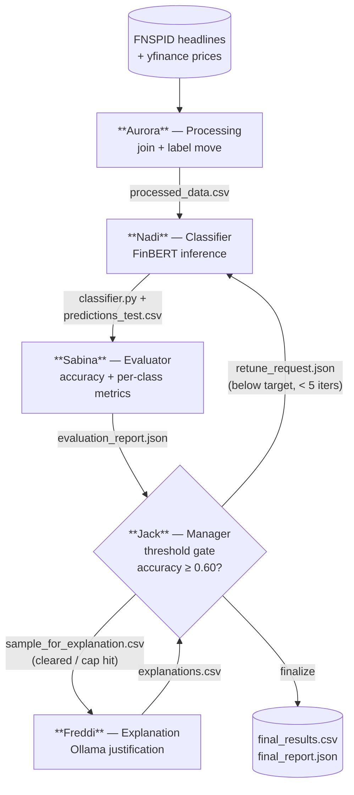

# NLP_lab

Predict next-day stock move (**up / down / neutral**) from financial-news
headlines with FinBERT, then explain each prediction in plain text. Five agents
pass contract files to each other in a retune loop driven by the Manager.

See [`CLAUDE.md`](./CLAUDE.md), [`docs/architecture.md`](./docs/architecture.md),
and [`docs/data_contracts.md`](./docs/data_contracts.md) for the full design.

## Pipeline flow


```mermaid
flowchart TD
    raw[("FNSPID headlines<br/>+ yfinance prices")] --> aurora

    aurora["**Aurora** — Processing<br/>join + label move"]
    nadi["**Nadi** — Classifier<br/>FinBERT inference"]
    sabina["**Sabina** — Evaluator<br/>accuracy + per-class metrics"]
    manager{"**Jack** — Manager<br/>threshold gate<br/>accuracy ≥ 0.60?"}
    freddi["**Freddi** — Explanation<br/>Ollama justification"]
    final[("final_results.csv<br/>final_report.json")]

    aurora -->|processed_data.csv| nadi
    nadi -->|classifier.py +<br/>predictions_test.csv| sabina
    sabina -->|evaluation_report.json| manager
    manager -->|"retune_request.json<br/>(below target, &lt; 5 iters)"| nadi
    manager -->|"sample_for_explanation.csv<br/>(cleared / cap hit)"| freddi
    freddi -->|explanations.csv| manager
    manager -->|finalize| final
```

**Loop:** the Manager gates on accuracy. Below the 0.60 target it writes a
`retune_request.json` and sends Nadi back around; once the target clears, the
accuracy plateaus (convergence early-stop), or the 5-iteration cap forces it, it
samples rows for Freddi, then joins the explanations into the final outputs. Each
retune escalates the classifier's hyperparameters instead of repeating, so the
loop actually explores rather than spinning.

The whole thing is one compiled **LangGraph** (`agents/pipeline_graph.py`) whose
retune loop is a real graph *cycle* (`gate → classify → evaluate → gate`), not a
Python loop. `main.py` just loads secrets, parses flags, and invokes the graph.

## Setup & run

Python 3.13, uv-managed. From repo root:

```bash
uv sync
uv run main.py          # drives the full pipeline
```

Sabina's evaluator is deterministic by default. To let Ollama review a small
misclassified-row sample and write the human-readable evaluator `reason` and
`code_notes` fields during a demo, start Ollama locally and run:

```bash
EVALUATOR_USE_OLLAMA=true uv run main.py
```

Optional knobs: `OLLAMA_URL` (default `http://localhost:11434/api/generate`) and
`EVALUATOR_OLLAMA_MODEL` (default `llama3.1`).
