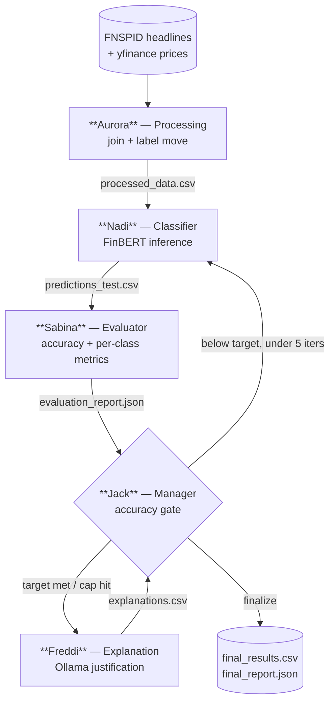

# NLP_lab — stock-move prediction from news headlines

Predict next-day stock move (**up / down / neutral**) from financial-news
headlines with FinBERT, then explain each prediction in plain text. Five agents
hand contract files to each other in a retune loop, compiled as a single
**LangGraph** whose loop is a real graph cycle (`gate → classify → evaluate → gate`).

## Pipeline


```mermaid
flowchart TD
    raw[("FNSPID headlines<br/>+ yfinance prices")] --> aurora
    aurora["**Aurora** — Processing<br/>join + label move"]
    nadi["**Nadi** — Classifier<br/>FinBERT inference"]
    sabina["**Sabina** — Evaluator<br/>accuracy + per-class metrics"]
    manager{"**Jack** — Manager<br/>accuracy gate"}
    freddi["**Freddi** — Explanation<br/>Ollama justification"]
    final[("final_results.csv<br/>final_report.json")]

    aurora -->|processed_data.csv| nadi
    nadi -->|predictions_test.csv| sabina
    sabina -->|evaluation_report.json| manager
    manager -->|below target, under 5 iters| nadi
    manager -->|target met / cap hit| freddi
    freddi -->|explanations.csv| manager
    manager -->|finalize| final
```

Below target the Manager writes a retune request and sends Nadi back around,
escalating hyperparameters each pass; once the target clears, accuracy plateaus,
or the 5-iteration cap is hit, it samples rows for Freddi and joins the
explanations into the final outputs.

## Setup & run

Python 3.13, [uv](https://docs.astral.sh/uv/)-managed. From the repo root:

```bash
uv sync
uv run main.py            # full pipeline (pretrained FinBERT, all data)
uv run pytest             # test suite (slow FinBERT tests deselected by default)
```

Optional: put `HF_TOKEN=...` in a `.env` for higher Hugging Face rate limits. To
let Ollama write Freddi's justifications (needs a local Ollama),
run `EVALUATOR_USE_OLLAMA=true uv run main.py`.

## Fine-tuning FinBERT

A separate, one-off step (not part of the loop). **Our recommended settings** —
the least-bad configuration we found (see Results):

| Hyperparameter | Value | Why |
|---|---|---|
| learning rate | `1e-5` | Our tested rate; a low LR curbs the overfitting that sets in after epoch 1 (validation accuracy peaks at epoch 1, then falls). |
| epochs | `3` | Best validation checkpoint was epoch 1 in every run; more epochs only overfit. |
| batch size | `16` | Fits a laptop MPS/CPU. |
| max_length | `64` | Headlines are short; the runs used 128 (mostly padding), so 64 should train faster at no accuracy cost (untested). |
| class weights | inverse-frequency (on) | Stops the model collapsing to all-neutral on the neutral-heavy training set. |
| seed | `42` | Reproducibility. |

```bash
# data/ is git-ignored — regenerate the reported (pre-COVID) window first:
uv run agents/aurora_processing.py --dataset-end 2019-12-31
uv run agents/finetune_finbert.py --data data/processed_data.csv --lr 1e-5 --epochs 3 --max-length 64
uv run main.py --dataset-end 2019-12-31 --model-dir outputs/finbert_finetuned
```

Omit `--dataset-end` to include 2020 H1 (the COVID crash) — that shifts the label
mix and the accuracies (see limitations below).

## Results (test window 2019-08 → 2019-12)

Test set: 2,196 rows, label mix ≈ 52% neutral / 26% up / 22% down.

| Model / baseline | Test accuracy |
|---|---|
| **all-neutral baseline** | **0.516** |
| fine-tuned FinBERT (lr 1e-5, 3 epochs) | 0.429 |
| uniform random | 0.333 |

(Numbers match the committed `outputs/finetune_report.json`; the pretrained-FinBERT
pipeline default varies with the retune config and also falls short of all-neutral.)

> Exact numbers vary with hardware (CPU / MPS / CUDA), library versions, and data
> regeneration — treat these as representative, not exact.

**Honest limitations.** No model beats the trivial all-neutral baseline (0.516):
on this neutral-heavy window, always guessing "neutral" is hard to beat.
Fine-tuning does not clear it (0.429) — it trades neutral accuracy for more
up/down calls (down recall rises to ~0.42) but nets below always-neutral, while
`up` recall collapses to ~0.07. The fine-tuned model does clear uniform random (0.333).
The ceiling is the task (one headline → next-day move), not the optimizer, and
reported accuracy is dominated by the window's label mix: on a COVID-era window
where neutral is rare (~21%), the same models score only ~0.21–0.27 and the
ranking between them flips (there, fine-tuned edges out pretrained) — so the
baselines matter more than the raw number.

## Team

| Agent | Owner | Role |
|---|---|---|
| Manager | Jack | orchestration loop, accuracy gate, final output |
| Processing | Aurora | join headlines ↔ prices, label the move |
| Classifier | Nadi | FinBERT → up / down / neutral |
| Evaluator | Sabina | accuracy + per-class metrics |
| Explanation | Freddi | plain-text justification per row |
