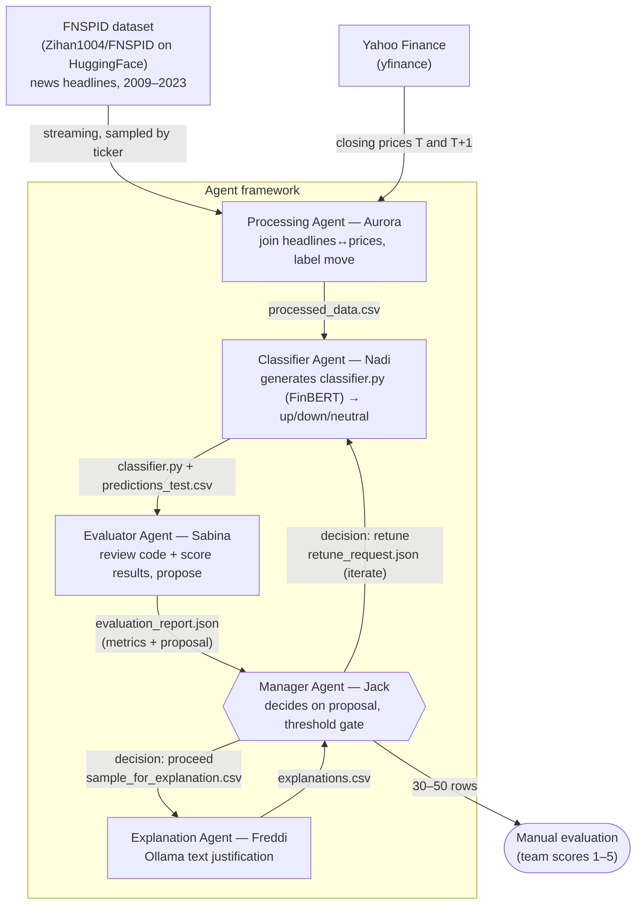

# Agent Architecture

Agent-based system for **stock price prediction from financial news**. A classification model (FinBERT) predicts next-day move (up/down/neutral) from headlines; agents orchestrate, evaluate, and **iteratively improve** performance, then produce a **text justification** for each prediction. Evaluation = prediction accuracy on the test set + manual review of explanations.

Data contracts in [`data_contracts.md`](./data_contracts.md).

## Data sources

| Source | Used for | How |
|---|---|---|
| FNSPID (`Zihan1004/FNSPID`) | News headlines | HuggingFace streaming, sampled by target ticker list (~500 articles per ticker) |
| yfinance | Closing prices T and T+1 | `Ticker.history()` with a small date window per article; weekends/holidays handled automatically |

FNSPID's full article body is unavailable in the HuggingFace version — `article_title` (headline) is used as the text input. FinBERT is designed for short financial text and performs well on headlines.

## Agents

| Agent | Owner | Role | Input | Output |
|---|---|---|---|---|
| Manager | Jack | Decide on Sabina's proposal (accept/override), apply accuracy threshold, sample for explanation | `evaluation_report.json` | `decision.json` + (`retune_request.json` \| `sample_for_explanation.csv`) |
| Processing | Aurora | Join FNSPID headlines to yfinance prices on date + ticker, derive next-day label | FNSPID + yfinance | `processed_data.csv` |
| Classifier | Nadi | Generate the classifier as Python (FinBERT) → up/down/neutral, run it | `processed_data.csv` (+ `retune_request.json` on loop) | `classifier.py` + `predictions_test.csv` |
| Evaluator | Sabina | Review generated code + score results on test split, propose next action | `classifier.py` + `predictions_test.csv` | `evaluation_report.json` (metrics + proposal) |
| Explanation | Freddi | Ollama-generated justification per prediction (~300 rows) | `sample_for_explanation.csv` | `explanations.csv` |

## Iterative improvement loop

1. Aurora joins FNSPID headlines to yfinance closing prices on `date` + `ticker`, calculates percentage change, assigns labels (>+1% = up, <-1% = down, in between = neutral), outputs `processed_data.csv`.
2. Nadi generates `classifier.py` (FinBERT), runs it on the test split, and outputs `predictions_test.csv`.
3. Sabina reviews `classifier.py` and scores the results (accuracy + per-class metrics), then outputs `evaluation_report.json` containing those metrics **and a proposal** (recommended action, focus labels, suggested params, code notes).
4. Jack **decides** on Sabina's proposal (accept or override), recording it in `decision.json`. If the decision is to retune, he writes `retune_request.json` back to Nadi to regenerate the code; otherwise he proceeds. Jack owns the threshold gate and the final call.
5. Once cleared, Jack samples ~300 rows and sends to Freddi for text justifications.
6. Team manually evaluates 30–50 explanations (score 1–5) — the second evaluation axis alongside accuracy.

## Evaluation (two axes)

- **Quantitative:** prediction accuracy on the held-out test set — Sabina. Accuracy is used because this is a 3-class classification task (up/down/neutral), not a continuous numerical prediction.
- **Qualitative:** manual review of 30–50 generated explanations, scored 1–5 — team, via Freddi's output.
