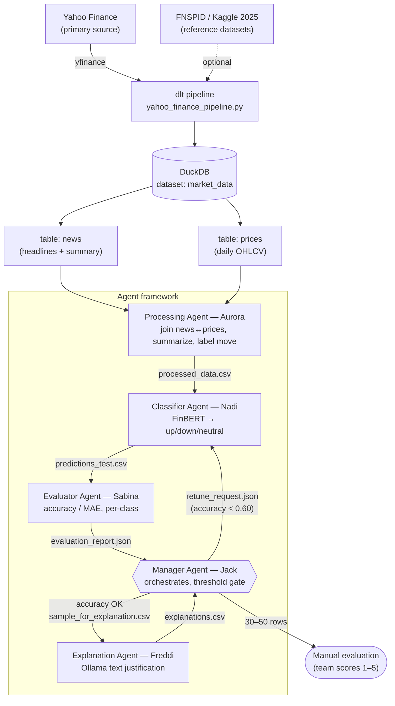

# Agent Architecture

Agent-based system for **stock price prediction from financial news**. A classification model (FinBERT) predicts next-day move (up/down/neutral) from headlines; agents orchestrate, evaluate, and **iteratively improve** performance, then produce a **text justification** for each prediction. Evaluation = prediction accuracy (or MAE) on the test set + manual review of explanations.

Data contracts in [`data_contracts.md`](./data_contracts.md).

## Agents

| Agent | Owner | Role | Input | Output |
|---|---|---|---|---|
| Manager | Jack | Orchestrate loop, apply accuracy threshold, sample for explanation | `evaluation_report.json` | gate decision + `sample_for_explanation.csv` |
| Processing | Aurora | Join `news`↔`prices`, summarize article text, derive next-day label | `news` + `prices` (DuckDB) | `processed_data.csv` |
| Classifier | Nadi | FinBERT sentiment → up/down/neutral | `processed_data.csv` | `predictions_test.csv` |
| Evaluator | Sabina | Accuracy / MAE, per-class metrics | `predictions_test.csv` | `evaluation_report.json` |
| Explanation | Freddi | Ollama-generated justification per prediction | `sample_for_explanation.csv` | `explanations.csv` |

## Interaction contracts

Every agent→agent edge has a data contract (full spec in [`data_contracts.md`](./data_contracts.md)):

| From → To | Contract | When |
|---|---|---|
| Aurora → Nadi | `processed_data.csv` | every run |
| Nadi → Sabina | `predictions_test.csv` | every run |
| Sabina → Jack | `evaluation_report.json` | every run |
| Jack → Nadi | `retune_request.json` | only if accuracy < 0.60 (loop) |
| Jack → Freddi | `sample_for_explanation.csv` | after threshold cleared |
| Freddi → Jack | `explanations.csv` | after explanations generated |

## Iterative improvement loop

1. Aurora builds the labelled set from the DuckDB source (`news` joined to `prices`) and summarizes the article text into `article_summary`.
2. Nadi classifies with FinBERT.
3. Sabina scores the test split (accuracy / MAE, per-class).
4. Jack gates on the threshold (accuracy < 0.60 → loop back to Nadi to retune; otherwise proceed).
5. Once cleared, Jack samples rows to Freddi for text justifications.
6. Team manually evaluates 30–50 explanations (score 1–5) — the second evaluation axis alongside accuracy.

## Evaluation (two axes)

- **Quantitative:** prediction accuracy (or MAE) on the held-out test set — Sabina.
- **Qualitative:** manual review of 30–50 generated explanations, scored 1–5 — team, via Freddi's output.
