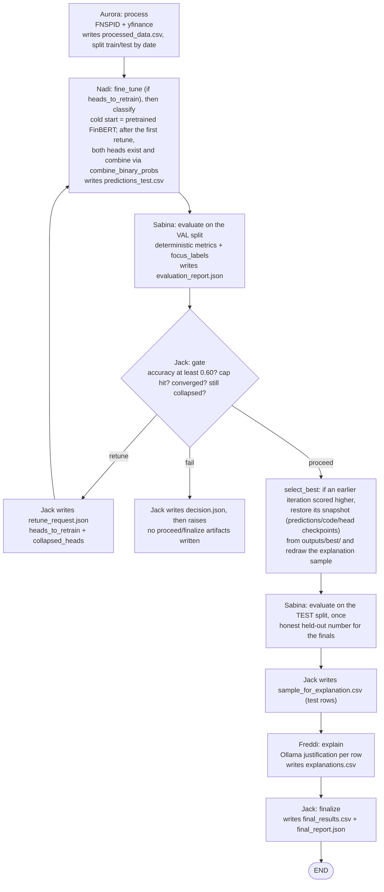

# The retune loop (as of `feature/classifier-owns-finetuning`)

Short report on what one pass of the pipeline looks like now that Nadi owns
fine-tuning and the model is two directional heads (ADR 0001/0002). File
formats live in [`data_contracts.md`](./data_contracts.md); agent roles in
[`architecture.md`](./architecture.md); the design decisions behind this pass
are in [`../../docs/adr/`](../adr/) and [`../../CONTEXT.md`](../../CONTEXT.md).

**One pass** = Nadi fine-tunes (if flagged) + classifies → Sabina evaluates →
Jack gates. The gate has four exits: retune (cycle back to Nadi), proceed
(sample for Freddi), finalize (once Freddi's explanations are back), and fail
(ADR 0004 — cap or convergence hit while a class is still collapsed).

## What changed

- **Nadi owns fine-tuning, not a separate agent.** Every retune fine-tunes the
  flagged directional head(s) — there is no more `inference_only` mode, no LLM
  rewrite of `classify()`, and no threshold/boost_factor knob-nudging schedule
  (ADR 0003). `classify()` is permanently deterministic template code; only
  the fine-tuned weights change between iterations.
- **Two directional heads, not one 3-class model.** `up`-head and `down`-head
  each train on a *filtered* split (their own class plus `neutral`; the
  opposite movement class is excluded entirely) rather than one-vs-rest
  (ADR 0002). At inference their positive-class probabilities combine via
  `combine_binary_probs` into the same three-way distribution the contract
  always expected.
- **`heads_to_retrain` replaces `suggested_params`.** Jack no longer proposes
  hyperparameters — he tells Nadi *which* head(s) need retraining
  (`retune_request.json`), and Nadi picks its own learning rate / focus weight
  per head from that head's own retry history.
- **Collapse hard-blocks the gate.** A collapsed class can no longer be forced
  to "proceed" by the iteration cap or convergence — that combination now
  produces `fail` instead: Jack writes the audit record then raises, and no
  `sample_for_explanation.csv` / `final_results.csv` / `final_report.json`
  ever gets written (ADR 0004).
- **`model_dir` opt-in is gone.** Nadi manages its own checkpoints under
  `outputs/finbert_finetuned/{up,down}/` and always cold-starts a fresh run
  from pretrained FinBERT — there is no external "seed with a prior
  checkpoint" flag any more.

## Flowchart

## Validation/test separation

The loop scores itself on the `val` rows (last 10% of training dates, assigned
by Aurora); the `test` rows are scored exactly once, after `select_best`, for
the final report. Before this, eight rounds of threshold tuning were measured
against the same test set they were later judged on — the final accuracy was
partly the loop overfitting the test rows.

## Gate rules

- Jack computes `heads_to_retrain` as the union of Sabina's `focus_labels`
  (filtered to `up`/`down` — `neutral` has no head) and any head whose recall
  has fallen below the collapse floor (0.05); never empty during a retune —
  both heads retrain if neither signal names one. `collapsed_heads` is the
  subset that's actually collapsed, which Nadi uses to start that head's next
  attempt at a higher focus weight.
- Aggregate accuracy can't clear the target while any class sits below the
  per-class recall floor (0.05) — an all-neutral collapse no longer "passes".
  Sabina also reports `class_support` in `evaluation_report.json`, so Jack can
  tell a real zero-recall collapse from a split that simply contains no rows
  for one label. Labels with `support = 0` do not block a cleared target.
- Unlike before, the iteration cap and convergence can no longer force a
  collapsed pass to `proceed` — that combination now produces `fail` instead
  (ADR 0004).
- Each run clears the previous run's loop artifacts from `outputs/` once
  Aurora's processing succeeds — a run that dies on its inputs leaves the
  previous deliverables intact (fine-tuned weights and the finetune report
  are always kept).
- Proceed fires on any of: target accuracy (0.60) cleared, iteration cap (5)
  hit, or convergence — the best of the last 2 iterations gained less than
  0.01 over the best before them — provided no class is still collapsed.
- On proceed, `select_best` restores the highest-scoring iteration's artifacts
  (predictions/code AND each directional head's checkpoint, snapshotted to
  `outputs/best/` on each new best; score = accuracy, penalized below any
  healthy score when a class collapsed — the same rule as the gate's floor).
  Each head's checkpoint is overwritten in place on every retrain, so without
  this snapshot a later retune could destroy the weights that earned an
  earlier pass's best score before `select_best` ever got to restore them.
