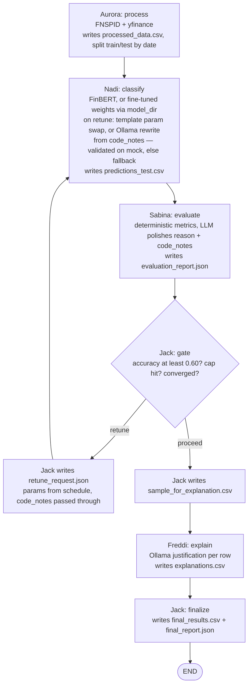

# The retune loop (as of `feature/manager-adapt`)

Short report on what one pass of the pipeline looks like after adapting the
Manager to Nadi's merged classifier (PR #34) and Sabina's merged evaluator
(PR #30). File formats live in [`data_contracts.md`](./data_contracts.md);
agent roles in [`architecture.md`](./architecture.md).

**One pass** = Nadi classifies → Sabina evaluates → Jack gates. The gate has
three exits: retune (cycle back to Nadi), proceed (sample for Freddi), and
finalize (once Freddi's explanations are back).

## What changed

- **`code_notes` now flows Jack → Nadi.** Sabina's code observations ride
  `retune_request.json`, feeding Nadi's optional Ollama rewrite of
  `classify()`. The rewrite is validated on mock data before it is trusted;
  anything that fails falls back to the deterministic template.
- **`model_dir` is an opt-in flag.** `uv run main.py --model-dir
  outputs/finbert_finetuned` hands the fine-tuned weights folder through the
  pipeline to Nadi's node. Omitted (the default) means pretrained FinBERT —
  the current fine-tune underperforms the all-neutral baseline, so it stays
  off unless explicitly requested.

## Flowchart

## Gate rules (unchanged)

- The first retune accepts Sabina's `suggested_params` as-is; every retune
  after that walks the Manager's `_RETUNE_SCHEDULE` (threshold ↓,
  max_length ↑, boost_factor ↑), skipping combinations already tried.
- Proceed fires on any of: target accuracy (0.60) cleared, iteration cap (5)
  hit, or convergence — the best of the last 2 iterations gained less than
  0.01 over the best before them.
