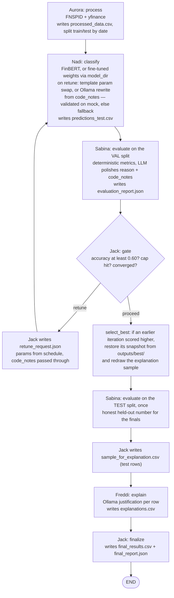

# The retune loop (as of `feature/manager-adapt`)

Short report on what one pass of the pipeline looks like after adapting the
Manager to Nadi's merged classifier (PR #34) and Sabina's merged evaluator
(PR #30). File formats live in [`data_contracts.md`](./data_contracts.md);
agent roles in [`architecture.md`](./architecture.md).

**One pass** = Nadi classifies → Sabina evaluates → Jack gates. The gate has
three exits: retune (cycle back to Nadi), proceed (sample for Freddi), and
finalize (once Freddi's explanations are back).

## What changed

- **`code_notes` now flows Jack → Nadi.** Sabina's code observations ride
  `retune_request.json`, feeding Nadi's optional Ollama rewrite of
  `classify()`. The rewrite is validated on mock data before it is trusted;
  anything that fails falls back to the deterministic template.
- **`model_dir` is an opt-in flag.** `uv run main.py --model-dir
  outputs/finbert_finetuned` hands the fine-tuned weights folder through the
  pipeline to Nadi's node. Omitted (the default) means pretrained FinBERT —
  the current fine-tune beats pretrained on the COVID test window but still
  trails the random baseline (0.33) and the 0.60 target (see
  [`finetune_runs.md`](./finetune_runs.md)), so it stays off unless
  explicitly requested.

## Flowchart

## Validation/test separation

The loop scores itself on the `val` rows (last 10% of training dates, assigned
by Aurora); the `test` rows are scored exactly once, after `select_best`, for
the final report. Before this, eight rounds of threshold tuning were measured
against the same test set they were later judged on — the final accuracy was
partly the loop overfitting the test rows.

## Gate rules (unchanged)

- The first retune accepts Sabina's `suggested_params` as-is; every retune
  after that walks the Manager's `_RETUNE_SCHEDULE` (threshold ↓,
  boost_factor ↑), skipping combinations already tried. (`max_length` was
  dropped as a knob — no headline exceeds 128 tokens.) If the last iteration
  regressed more than 0.05 below the best, the Manager instead reverts to the
  best iteration's params and perturbs one knob.
- Aggregate accuracy can't clear the target while any class sits below the
  per-class recall floor (0.05) — an all-neutral collapse no longer "passes".
  Sabina also reports `class_support` in `evaluation_report.json`, so Jack can
  tell a real zero-recall collapse from a split that simply contains no rows
  for one label. Labels with `support = 0` do not block a cleared target.
- Each run clears the previous run's loop artifacts from `outputs/` once
  Aurora's processing succeeds — a run that dies on its inputs leaves the
  previous deliverables intact (fine-tuned weights and the finetune report
  are always kept).
- Proceed fires on any of: target accuracy (0.60) cleared, iteration cap (5)
  hit, or convergence — the best of the last 2 iterations gained less than
  0.01 over the best before them.
- On proceed, `select_best` restores the highest-scoring iteration's artifacts
  (predictions/report/classifier snapshotted to `outputs/best/` on each new
  best; score = accuracy, penalized below any healthy score when a class
  collapsed — the same rule as the gate's floor), so a regressed final retune
  can't ship worse results than an earlier pass — accuracy did regress
  0.39 → 0.23 on the 2026-07-04 run.
